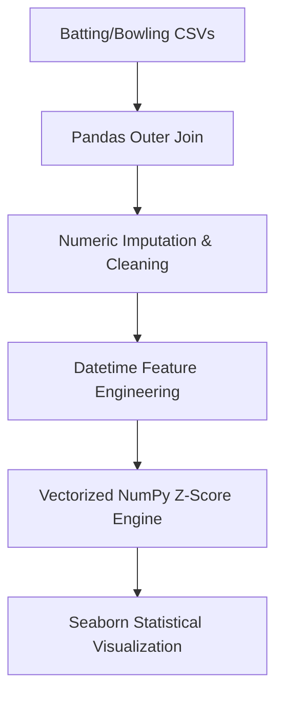

# IPL Cricket Data Analyzer: Engineering Statistical Outliers

## Problem Statement
In professional cricket, raw total runs or wickets only tell part of the story. To truly evaluate player value, management needs to identify **statistical anomalies**—players whose performance deviates significantly from the mean. 

This project is an end-to-end Data Engineering and Analysis pipeline that ingests raw, disparate IPL 2025 player data, merges it, cleans missing values, synthesizes contract timelines, and uses vectorized mathematics to calculate Z-Scores, ultimately isolating elite outliers.

## Architecture & Data Flow


## Tech Stack
Language: Python 3

Data Manipulation: Pandas (Outer Joins, Boolean Filtering, Datetime conversion)

Statistical Compute: NumPy (Vectorized mean/std operations)

Environment: Jupyter Notebook / VS Code


## Installation & Execution

1. Clone this repository to your local machine.

2. Ensure you have Python installed, then install the required dependencies:
```bash
pip install pandas numpy jupyter matplotlib seaborn
```

3. Open the Jupyter Notebook:
```bash
jupyter notebook analysis.ipynb
```


